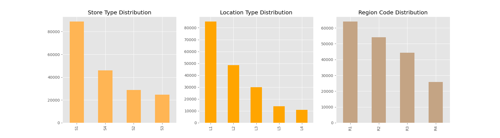

# Group1-Project-5

This project aims to develop a machine learning model that can forecast sales by region for the following month in order to assist in workforce optimization at WoMart. The data used for this project consists of historical sales data for different regions and products.

## Problem Statement

WoMart is currently unable to efficiently deploy its workforce due to the lack of accurate sales forecasting. This can lead to overstaffing in some regions and understaffing in others, resulting in reduced profitability and customer satisfaction. The objective of this project is to develop a model that can accurately predict sales for each region, so that WoMart can better plan and allocate its workforce based on the expected demand.

By accurately forecasting sales, WoMart can optimize its workforce and ensure that it has the right number of employees in each region to meet customer demand. This can lead to increased profitability and customer satisfaction, as well as improved employee morale and job satisfaction.

## Data Description

The  consists of 18 months sales data from January 2018 to May 2019, including the date, region code, store type, location type number of orders per day for each store and whether the day was holiday and any promotion deals were going on. Weekly data for each region has been build and used.

## Approach

The approach for this project will involve the following steps:

- Data Preprocessing: Cleaning and preprocessing the data to prepare it for machine learning modeling.

- Exploratory Data Analysis (EDA): Visualizing the data to understand its patterns and trends, and to identify any outliers, missing values or correlations between variables.

- Feature Engineering: Creating new features and encoding categorical variables, to improve the performance of the machine learning model.

- Model Selection: Selecting the appropriate machine learning algorithm, based on the characteristics of the data and the problem statement.

- Model Training: Training the selected model on the training data, using appropriate hyperparameters.

- Model Evaluation: Evaluating the performance of the model on the validation data, using appropriate metrics.

- Hyperparameter Tuning: Tuning the hyperparameters of the model, to optimize its performance on the validation data.

- Final Model: Training the final model on the entire dataset, using the optimal hyperparameters.

- Making Predictions: Using the final model to make predictions for the sales in each region for the following month.

## Data Investigation

- How are the stores distrubuted?

- Do stores perform better if they are a certain store type, location type, region?

- Time Series Sales & Orders Plots: Daily and Monthly

## Modeling

The project uses a time series linear regression model to forecast sales for the following month. The model is built using 71 weeks of sales data from Jan 2018 - May 2019. To build time series data, four lags of weekly sales prediction were added. Variable lagging is a common practice in time series analysis. The idea is to add "lagged" versions of the dependent variable, in this case the sales data, to the model.
We accomplish this by creating a new column for each lagged variable, and then shifting the data in the column by the number of periods we want to lag the variable.
Since our data is separated into regions, we will need to separate the data into regions and then lag the data for each region separately.

The daily data was converted to weekly and then reqrouped to four regions. Then the stationary factor for time series was checked.
The model is trained on the historical data, and the coefficients are estimated using linear regression.

Once the model is trained, it can be used to forecast sales for the following month. To do this, we first gather the relevant features for the next month, such as holidays and discount counts for each week, 4 weekly lags and number of orders per region. We then use these features to predict the sales for each day in the next month.

The performance of the model is evaluated using a variety of metrics, including mean squared error (MSE), root mean squared error (RMSE) and R2 score.

## Results

Let's take a look at results!
|Region | Train_R2 | Test_R2 | Train_RMSE | Test_RMSE |
|---|---|---|---|---|
|R1|0.7699|0.9461|2.4e+06|1.59e+06|
|R2|0.7602|0.9021|1.64e+06|1.25e+06|
|R3|0.7922|0.9560|1.49e+06|9.66e+05|
|R4|0.7725|0.9510|8.17e+05|5.13e+05|

Let's take a look at predictions!

We have a model that can predict the next month of data with shocking accuracy for its simplicity.

## Future Work

In future work, we can explore the use of more advanced models such as ARIMA, LSTM, or Prophet to improve the accuracy of the sales forecasts. We can also investigate the use of additional features that may affect sales, such as competitor pricing and social media sentiment.
